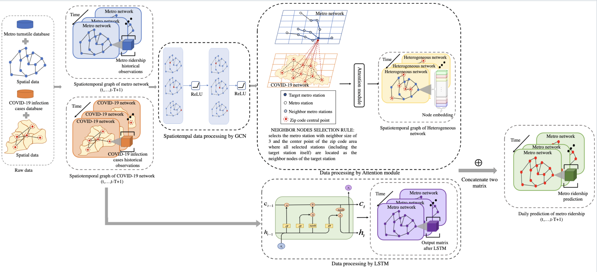

# HetGAN

> Implementation of **Het**erogeneous **G**raph **A**ttention **N**etwork

> This is the code repository of paper "Prediction of Metro Ridership During the COVID-19 Pandemic: A Deep Learning Approach Based on Heterogeneous Graph" which is submitted to Transportation Rsearch Part C: Emgerging Technologies.


## Datasets

- New York City COVID case number
- New York City Metro Ridership Number


## Model Framework



## How to Run?

- Single run:

```bash
cd Experiments/
python main.py --epoch 200 --seed 1230 --log_file='./logs/running_log.log'
```

- Grid Search:

  ```bash
  cd Experiments/
  python grid_search.py --epoch 200 --seed 1230 --log_file='./logs/grid_search.log'
  ```

  